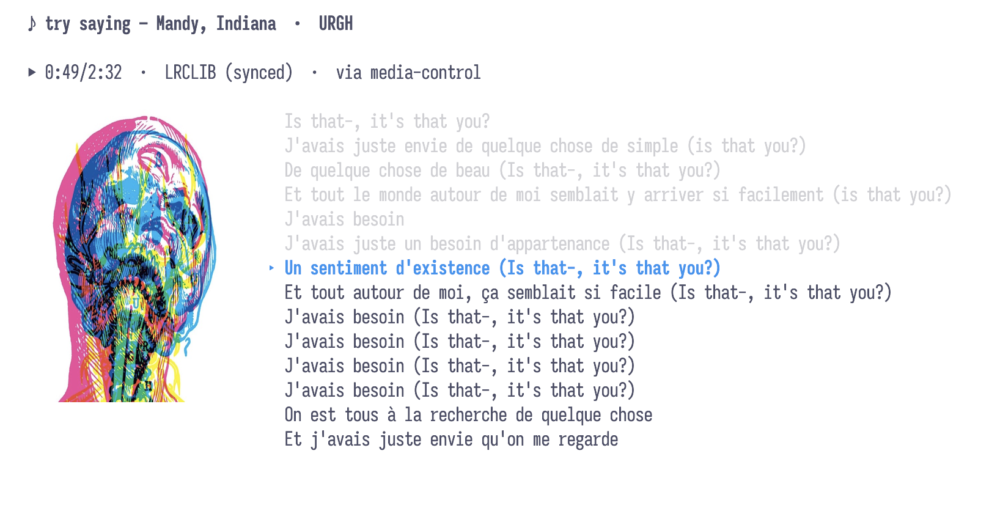

# genius-tui

Synced lyrics for whatever is playing, in your terminal.

Detects the currently playing song **system-wide on macOS**, fetches
time-synchronized lyrics from **LRCLIB** (free, no API key), and falls back
to scraping plain lyrics from **Genius** when no synced version exists.
Synced lines highlight and auto-scroll in time with playback.

<picture>
  <source media="(prefers-color-scheme: dark)" srcset="assets/screenshot-dark.png">
  <source media="(prefers-color-scheme: light)" srcset="assets/screenshot-light.png">
  
</picture>

> Note: Genius itself only has plain-text lyrics (no timestamps), which is
> why LRCLIB is the primary source for true sync.

## Install & run

```sh
uvx genius-tui            # run without installing
# or
pip install genius-tui && genius-tui
# or, from a checkout
uv run genius-tui
```

## Now-playing backends

Tried in order; the first one that works is remembered:

1. `media-control` — system-wide, works on macOS 15.4+ (`brew install media-control`)
2. `nowplaying-cli` — system-wide, older macOS (`brew install nowplaying-cli`)
3. Spotify via AppleScript (no install needed)
4. Apple Music via AppleScript (no install needed)

So with Spotify or Apple Music it works out of the box; install
`media-control` for other players (browser, VLC, etc.). The first
AppleScript call may trigger a macOS Automation permission prompt for your
terminal.

## Keys

| Key   | Action                                   |
|-------|------------------------------------------|
| `q`   | Quit                                     |
| `r`   | Refetch lyrics                           |
| `+`/`-` | Nudge sync offset ±0.5 s               |
| `f`   | Toggle auto-follow (free scrolling)      |
| `h`   | Toggle footer                            |
| `l`   | Toggle lyrics-only mode                  |

## Behavior notes

- Synced (LRCLIB): current line is highlighted and centered.
- Plain (LRCLIB/Genius): position is estimated from track progress, so
  scrolling is approximate.
- Status bar shows position, lyrics source, detection backend, and offset.
